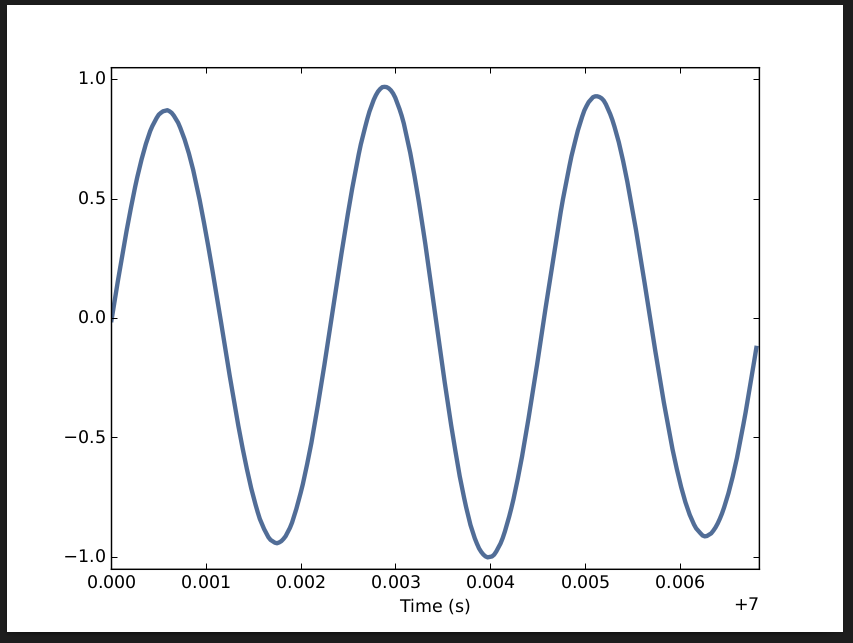
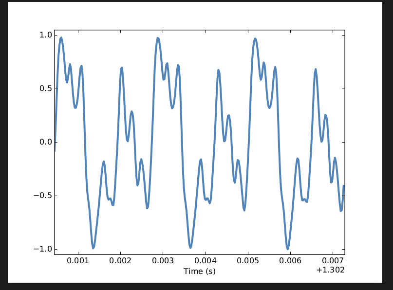
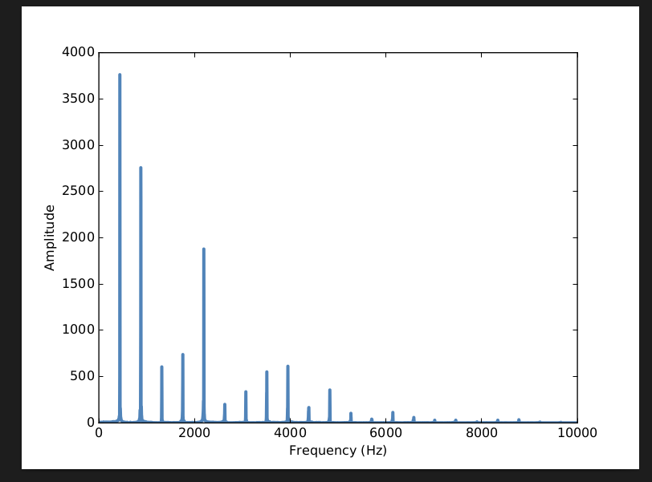

# Resumen Primeras sub secciones

## Capitulo 1 Sonidos y señales

Una señal representa una cantidad que varia en el tiempo. Esta definición es bastante abstracta, así que empezamos con un ejemplo concreto: el sonido. El sonido es la variació en la presión del aire. Una señal de sonido representa variaciones en la presión del aire sobre el tiempo.

Un microfono es un dispositivo que mide estas variaciones y genera una señal electrica que representa sonido. Un parlante es un dispositivo que toma una señal electrica y produce sonido. Tanto los microfonos como los parlantes son llamados **transductores** ya que transducen, o convierten, señales de una forma a otra.

Este libro es acerca el procesamiento de señales, que incluye procesos para sintetizar, transformar y analizar señales. Se va a enfocar en señales de sonido, pero los mismos metodos aplicaon a señales electronicas, vibraciones mecanicas y señales en otros dominios.

También aplican a señales que varian en el espacio en vez del tiempo, como elevaciones a lo largo de una ruta de senderismo. Y también aplican a señales en mas de una dimensión, como una imagen, que puede llegar a pensarse como una señal que varia en un espacio bidimensional. O una película, cuya señal varia en dos dimensiones **espacio** y **tiempo**.

Pero vamos a empezar con un sonido simple unidimensional.

> El codigo para este capitulo esta en chap01.ipynb que esta en el repositorio de este libro.

## 1.1 Señales periodicas

Vamos a empezar con **señales periodicas**, que son señales que se repiten ellas mismas despues de un periodo de timepo. Por ejemplo, si se golpea una campana, vibra y genera sonido. Si almacenamos este sonido y lo graficamos la señal transducida se vera como la figura.

  

Esta señal se asemeja a un sinusoide, lo que quiere decir que tiene la misma forma que la función trigonometríca seno. 

Se puede ver que la señal es periodica. Escogí la duración para mostrar 3 repeticiones completas, también conocidas como **ciclos**. La duración de cada ciclo, llamado **periodo**, es de unos 2.3 milisegundos.

La **frecuencia** de una señal es el numero de ciclos por segundo, que es la inversa del periodo. Las unidades de frecuencia son ciclos por segundo, o **Hertz**, abreviados "Hz". (Estrictamente hablando, el numero de ciclos es un numero sin dimensión, por lo que un Hertz realmentes es "por segundo").

La frecuencia de esta señal es de 439 HZ aproximadamente, un poco mas bajo de 440 Hz, quees el estandart de afinación para la musica orquestal. La nomre musical de esta nota es A, o más especificamente A4. Si no eres familiar con la "notación científica", el sufijo numerico indica en que ocatava esta la nota. A4 es la A por encima de la C media. A5 es una octava más alta. Ver [wikipedia índice acústico ciéntifico](https://es.wikipedia.org/wiki/%C3%8Dndice_ac%C3%BAstico_cient%C3%ADfico) 

Un diapasón genera un sinusoide porque las vibraciones de las pues es una forma de movimiento armonico simple. La mayoría de instrumentos musicales producen señales periodicas, pero la forma de estas señales no es sinusoidal. Por ejemplo un violín:

  

Podemos ver que la señal es periodica, pero la forma de la señal es más compleja. La forma de una señal periodica es denominada **onda**. La mayoría de instrumentos musicales producen ondas mas complejas que un sinusoide. La forma de la onda determina el **timbre** músical, que es nuestra percepción de la calidad del sonido. Las personas usualmente perciven onda complejas como mas ricas, acogedoras e interesantes que los sinusoides.

## Descomposición espectral

El tema más importante en este libro es la **descomposición espectral**, que es la idea de que una señal puede ser expresada como la suma de sinusoides con diferentes frecuencias.

La idea matematica mas importante en este libro es la **Transformada Directa de Fourier** o **DFT** (por sus siglas en ingles Direct Fourier Transform), que toma una señal y produce su **espectro**. El espectro es el conjunto de sinusoides que se suman para producir la señal.

Y el algoritmo mas importantes en este libro es la **Transformada rapída de Fourier** o **FFT** (por sus siglas en ingles Fast Fourier Transform), que es una manera eficiente de computar la DFT.

Por ejemplo, la figura nos muestra el espectro del violín anteriormente visto. El eje x es el rango de las frecuencias que hacen la señal. El eje y muestra la fuerza o **amplitud** de cada componente de la frecuencia.

  

El componente más bajo de frecuencia es llamado **frecuencia fundamental**. La frecuencia fundamental de esta señal se aproxima a los 440 Hz.

En esta señal la frecuencia fundamental tiene la amplitud más grande, por lo que se denomina el **dominio de la frecuencia**. Normalmente el tono de un sonido es determinado por la frecuencia fundamental, incluso si esta no es dominante.

Los otros picos en el espectro son las frecuencias 880, 1320, 1760 y 2200, que son multiples enteros de la frecuencia fundamental. Estos componentes son llamados **armonicos** porque son musicalmente armoniosos con la frecuencia fundamental.

* 880 is la frecuencia de A5, una octava mas alta que la fundamental. Una **octava** es una duplicación en frecuencia.

* 1320 es aproximadamente E6, que es un quinto perfecto encima de A5. Para mas información ver [link](https://es.wikipedia.org/wiki/Intervalo_(m%C3%BAsica))

* 1760 es A6, 2 octavas encima de la fundamental.

* 2200 es aproximadamente C7, es es la tercera mayor por encima de A6.

Estas armonicas componen las notas de un acoder A mayor, aunque no todas en la misma octava. Algunas de ellas estan solo aproximadamente porque las notas que hacen la música occidental han sido ajustadas para una misma disposición. ver [link](https://es.wikipedia.org/wiki/Temperamento_igual)

Dadas las armoincas y sus amplitudes, se puede recontruir la señal al adicionar los sinusoides. A continuación vamos a ver como.
